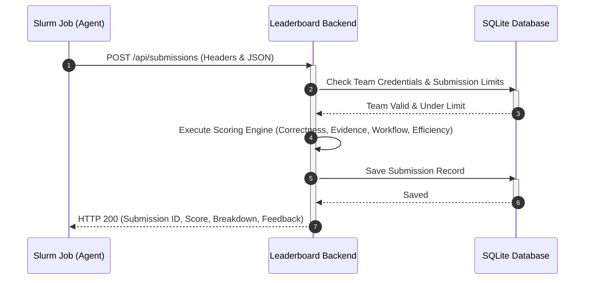

# API Contract: Score Sending (Leaderboard Submissions)

This document defines the interface for submitting agent run results to the HPC Summer School mini-hackathon leaderboard.

---

## Architecture Overview



---

## Endpoint Details

- **Path**: `/api/submissions`
- **Method**: `POST`
- **Headers**:
  - `Content-Type: application/json`
  - `X-Team-ID: <TEAM_ID>` (e.g. `team01`)
  - `X-Team-Token: <TEAM_TOKEN>` (The cryptographically secure token assigned to your team)

---

## Request Payload Schema (`SubmissionRequest`)

The JSON body represents the full execution details and final analysis generated by your agent.

```json
{
  "team": {
    "team_id": "string (required) - Must match X-Team-ID header",
    "team_name": "string (required)",
    "slurm_job_id": "string (optional) - The SLURM job ID of this run"
  },
  "workflow_metadata": {
    "workflow_mode": "string (optional) - 'sequential' or 'parallel'",
    "num_agents": "integer (optional)",
    "max_parallel_agents": "integer (optional)",
    "models_used": ["string (optional)"],
    "model_roles": [
      {
        "model": "string (required)",
        "roles": ["string (required)"]
      }
    ],
    "has_aggregator": "boolean (optional) - default: false",
    "has_verifier": "boolean (optional) - default: false",
    "llm_calls": "integer (optional)",
    "runtime_sec": "float (optional)",
    "estimated_input_tokens": "integer (optional)",
    "estimated_output_tokens": "integer (optional)"
  },
  "answer": {
    "repository_summary": {
      "main_entrypoint": "string (optional) - The primary executable/script",
      "workload_type": "string (optional)",
      "framework": "string (optional)",
      "model_family": "string (optional)",
      "dataset_type": "string (optional)",
      "uses_gpu": "boolean (optional)"
    },
    "resource_recommendation": {
      "gpu_count": "integer (optional)",
      "gpu_memory_class": "string (optional)",
      "cpus_per_task": "integer (optional)",
      "system_memory_gb": "integer (optional)",
      "time_limit": "string (optional) - Format: 'HH:MM:SS' or 'MM:SS'",
      "slurm_gres": "string (optional)",
      "rationale": "string (optional)"
    },
    "bottleneck_analysis": {
      "primary_bottleneck": "string (optional)",
      "cpu": "string (optional)",
      "gpu_compute": "string (optional)",
      "gpu_memory": "string (optional)",
      "storage_io": "string (optional)",
      "network_io": "string (optional)",
      "logging_checkpoint": "string (optional)"
    },
    "evidence": [
      {
        "claim": "string (required)",
        "source_file": "string (optional) - Path of the file verifying this claim",
        "artifact_type": "string (optional)",
        "evidence_summary": "string (optional)",
        "confidence": "string (optional) - e.g. 'high', 'medium', 'low'"
      }
    ],
    "uncertainty": ["string (optional)"],
    "validation_plan": ["string (optional)"]
  },
  "trace_summary": {
    "agents": [
      {
        "agent_name": "string (optional)",
        "role": "string (optional)",
        "model": "string (optional)",
        "calls": "integer (optional)",
        "runtime_sec": "float (optional)",
        "input_tokens": "integer (optional)",
        "output_tokens": "integer (optional)"
      }
    ],
    "parallel_groups": [
      {
        "name": "string (optional)",
        "agents": ["string (optional)"],
        "start_time": "string (optional)",
        "end_time": "string (optional)"
      }
    ],
    "verification": {
      "ran": "boolean (optional) - default: false",
      "issues_found": "integer (optional) - default: 0",
      "issues_fixed": "integer (optional) - default: 0"
    }
  }
}
```

---

## Response Payload Schema (`SubmissionResponse`)

Upon submitting successfully, you will receive a breakdown of your score along with rule evaluation logs.

```json
{
  "submission_id": 12,
  "valid": true,
  "score": 85.5,
  "rank": 2,
  "breakdown": {
    "correctness": 38.0,
    "evidence": 20.5,
    "workflow": 15.0,
    "efficiency": 12.0
  },
  "messages": [
    "Correct main entrypoint (+5)",
    "Correct framework (+5)",
    "Evidence cites required file: run.sh",
    "Valid source file citations: 4/4 (+6)",
    "High-confidence evidence items: 4/4 (+5)",
    "No forbidden claims found (+5)",
    "Meaningful agent decomposition (>=4 agents) (+5)",
    "Sequential workflow mode (no parallel bonus)",
    "Excellent runtime (<=300s) (+5)",
    "Efficient LLM calls (18) (+4)"
  ]
}
```

---

## HTTP Response Codes

| Status Code | Description | Cause / Mitigation |
| :--- | :--- | :--- |
| **`200 OK`** | Submission completed and scored | Successfully added to the leaderboard history. |
| **`400 Bad Request`** | Mismatched metadata | E.g. `team.team_id` in the body does not match the `X-Team-ID` header. |
| **`403 Forbidden`** | Unauthorized team credentials | Invalid or missing `X-Team-ID` or `X-Team-Token`. |
| **`422 Unprocessable Entity`** | Invalid JSON structure | Schema validation failed against the `SubmissionRequest` model. |
| **`429 Too Many Requests`** | Submission limit reached | The team has reached the maximum submission limit (default: 10). |
| **`500 Internal Server Error`** | Server-side exception | Database or routing error. |

---

## Python Integration Example

Here is a ready-to-use Python snippet to compile, validate, and upload your agent results at the end of a run.

```python
import os
import json
import requests

def send_score(answer_data, workflow_metadata, trace_summary=None):
    """
    Submits score to the leaderboard server.
    Reads credentials from X_TEAM_ID and X_TEAM_TOKEN environment variables.
    """
    host = os.environ.get("LEADERBOARD_HOST", "localhost:8000")
    team_id = os.environ.get("X_TEAM_ID")
    team_token = os.environ.get("X_TEAM_TOKEN")
    slurm_job_id = os.environ.get("SLURM_JOB_ID")

    if not team_id or not team_token:
        print("[-] Missing X_TEAM_ID or X_TEAM_TOKEN environment variables.")
        return None

    url = f"http://{host}/api/submissions"
    
    headers = {
        "Content-Type": "application/json",
        "X-Team-ID": team_id,
        "X-Team-Token": team_token
    }

    payload = {
        "team": {
            "team_id": team_id,
            "team_name": f"Team {team_id.replace('team', '')}",
            "slurm_job_id": slurm_job_id
        },
        "workflow_metadata": workflow_metadata,
        "answer": answer_data,
        "trace_summary": trace_summary or {"agents": [], "parallel_groups": [], "verification": {}}
    }

    try:
        response = requests.post(url, headers=headers, json=payload)
        if response.status_code == 200:
            print("[+] Submission successful!")
            result = response.json()
            print(f"    Submission ID: {result['submission_id']}")
            print(f"    Score: {result['score']} (Rank: {result['rank']})")
            print(f"    Messages: {', '.join(result['messages'])}")
            return result
        else:
            print(f"[-] Submission failed with status {response.status_code}: {response.text}")
            return None
    except Exception as e:
        print(f"[-] Error making request: {str(e)}")
        return None

# --- Usage Example ---
if __name__ == "__main__":
    # 1. Fill your answer details
    sample_answer = {
        "repository_summary": {
            "main_entrypoint": "train.py",
            "workload_type": "deep_learning",
            "framework": "pytorch",
            "model_family": "resnet",
            "dataset_type": "images",
            "uses_gpu": True
        },
        "resource_recommendation": {
            "gpu_count": 1,
            "cpus_per_task": 4,
            "system_memory_gb": 16,
            "time_limit": "01:00:00"
        },
        "bottleneck_analysis": {
            "primary_bottleneck": "gpu_compute"
        },
        "evidence": [
            {
                "claim": "The code uses PyTorch with ResNet.",
                "source_file": "train.py",
                "confidence": "high"
            }
        ]
    }

    # 2. Fill workflow details
    sample_metadata = {
        "workflow_mode": "sequential",
        "num_agents": 4,
        "models_used": ["gpt-4o"],
        "has_aggregator": True,
        "has_verifier": True,
        "llm_calls": 15,
        "runtime_sec": 120.5,
        "estimated_input_tokens": 12000,
        "estimated_output_tokens": 4000
    }

    # Set temporary environment vars for testing
    os.environ["LEADERBOARD_HOST"] = "localhost:8000"
    os.environ["X_TEAM_ID"] = "team01"
    os.environ["X_TEAM_TOKEN"] = "hpc-team01-gIPHExDrbwrpYtnXkkt1IQ" # Replace with actual token

    send_score(sample_answer, sample_metadata)
```
