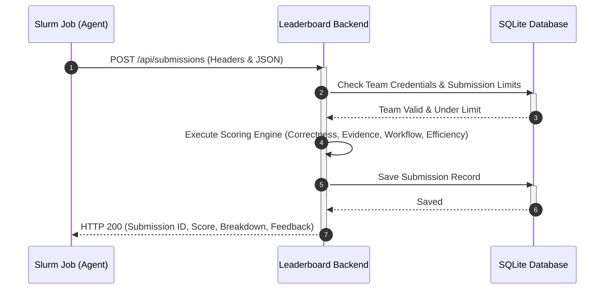

# API Contract: Score Sending (Leaderboard Submissions)

This document defines the interface for submitting agent run results to the HPC Summer School mini-hackathon leaderboard.

---

## Architecture Overview



---

## Endpoint Details

- **Path**: `/api/submissions`
- **Method**: `POST`
- **Headers**:
  - `Content-Type: application/json`
  - `X-Team-ID: <TEAM_ID>` (e.g. `team01`)
  - `X-Team-Token: <TEAM_TOKEN>` (The cryptographically secure token assigned to your team)

---

## Request Payload Schema (`SubmissionRequest`)

The JSON body represents the full execution details and final analysis generated by your agent.

```json
{
  "team": {
    "team_id": "string (required) - Must match X-Team-ID header",
    "team_name": "string (required)",
    "slurm_job_id": "string (optional) - The SLURM job ID of this run"
  },
  "workflow_metadata": {
    "workflow_mode": "string (optional) - 'sequential' or 'parallel'",
    "num_agents": "integer (optional)",
    "max_parallel_agents": "integer (optional)",
    "models_used": ["string (optional)"],
    "model_roles": [
      {
        "model": "string (required)",
        "roles": ["string (required)"]
      }
    ],
    "has_aggregator": "boolean (optional) - default: false",
    "has_verifier": "boolean (optional) - default: false",
    "llm_calls": "integer (optional)",
    "runtime_sec": "float (optional)",
    "estimated_input_tokens": "integer (optional)",
    "estimated_output_tokens": "integer (optional)"
  },
  "answer": {
    "repository_summary": {
      "main_entrypoint": "string (optional) - The primary executable/script",
      "workload_type": "string (optional)",
      "framework": "string (optional)",
      "model_family": "string (optional)",
      "dataset_type": "string (optional)",
      "uses_gpu": "boolean (optional)"
    },
    "resource_recommendation": {
      "gpu_count": "integer (optional)",
      "gpu_memory_class": "string (optional)",
      "cpus_per_task": "integer (optional)",
      "system_memory_gb": "integer (optional)",
      "time_limit": "string (optional) - Format: 'HH:MM:SS' or 'MM:SS'",
      "slurm_gres": "string (optional)",
      "rationale": "string (optional)"
    },
    "bottleneck_analysis": {
      "primary_bottleneck": "string (optional)",
      "cpu": "string (optional)",
      "gpu_compute": "string (optional)",
      "gpu_memory": "string (optional)",
      "storage_io": "string (optional)",
      "network_io": "string (optional)",
      "logging_checkpoint": "string (optional)"
    },
    "answers": [
      {
        "question_id": "string (required)",
        "difficulty": "string (optional)",
        "question": "string (optional)",
        "answer": "string (optional)",
        "evidence": [
          {
            "file": "string (optional)",
            "lines": [1, 2],
            "reason": "string (optional)"
          }
        ],
        "confidence": "string (optional)"
      }
    ],
    "evidence": [
      {
        "claim": "string (required)",
        "source_file": "string (optional) - Path of the file verifying this claim",
        "artifact_type": "string (optional)",
        "evidence_summary": "string (optional)",
        "confidence": "string (optional) - e.g. 'high', 'medium', 'low'"
      }
    ],
    "uncertainty": ["string (optional)"],
    "validation_plan": ["string (optional)"]
  },
  "trace_summary": {
    "agents": [
      {
        "agent_name": "string (optional)",
        "role": "string (optional)",
        "model": "string (optional)",
        "calls": "integer (optional)",
        "runtime_sec": "float (optional)",
        "input_tokens": "integer (optional)",
        "output_tokens": "integer (optional)"
      }
    ],
    "parallel_groups": [
      {
        "name": "string (optional)",
        "agents": ["string (optional)"],
        "start_time": "string (optional)",
        "end_time": "string (optional)"
      }
    ],
    "verification": {
      "ran": "boolean (optional) - default: false",
      "issues_found": "integer (optional) - default: 0",
      "issues_fixed": "integer (optional) - default: 0"
    }
  }
}
```

---

## Response Payload Schema (`SubmissionResponse`)

Upon submitting successfully, you will receive a breakdown of your score along with rule evaluation logs.

```json
{
  "submission_id": 12,
  "valid": true,
  "score": 85.5,
  "rank": 2,
  "breakdown": {
    "correctness": 38.0,
    "evidence": 20.5,
    "workflow": 15.0,
    "efficiency": 12.0
  },
  "messages": [
    "Correct main entrypoint (+5)",
    "Correct framework (+5)",
    "Evidence cites required file: run.sh",
    "Valid source file citations: 4/4 (+6)",
    "High-confidence evidence items: 4/4 (+5)",
    "No forbidden claims found (+5)",
    "Meaningful agent decomposition (>=4 agents) (+5)",
    "Sequential workflow mode (no parallel bonus)",
    "Excellent runtime (<=300s) (+5)",
    "Efficient LLM calls (18) (+4)"
  ],
  "legacy_score": 88.0,
  "qa_score": 36.0,
  "final_score": 85.5,
  "qa_details": [
    {
      "question_id": "public-q01",
      "score": 1.6,
      "max_score": 1.6,
      "answer_ok": true,
      "evidence_ok": true,
      "submitted_evidence_files": ["evidence/repo/src/train.py"],
      "required_evidence_files": ["evidence/repo/src/train.py"]
    }
  ]
}
```

`score` is the same value as `final_score`. The four values in `breakdown` are
the legacy category scores before rebalancing; use `qa_score`, `legacy_score`,
and `qa_details` to audit how the final score was formed. See
`SCORING_GUIDE.md` for the exact formula and runtime penalties.

---

## HTTP Response Codes

| Status Code | Description | Cause / Mitigation |
| :--- | :--- | :--- |
| **`200 OK`** | Submission completed and scored | Successfully added to the leaderboard history. |
| **`400 Bad Request`** | Mismatched metadata | E.g. `team.team_id` in the body does not match the `X-Team-ID` header. |
| **`403 Forbidden`** | Unauthorized team credentials | Invalid or missing `X-Team-ID` or `X-Team-Token`. |
| **`422 Unprocessable Entity`** | Invalid JSON structure | Schema validation failed against the `SubmissionRequest` model. |
| **`429 Too Many Requests`** | Submission limit reached | The team has reached the maximum submission limit (default: 10). |
| **`500 Internal Server Error`** | Server-side exception | Database or routing error. |

---

## Submission example

The paired public A1 workflow already creates a conforming payload. Set only
real event credentials outside source control, then submit it as follows:

```bash
curl -X POST "http://<leaderboard-host>:8000/api/submissions" \
  -H "Content-Type: application/json" \
  -H "X-Team-ID: <team-id>" \
  -H "X-Team-Token: <team-token>" \
  --data-binary @results/hackathon_submission_local.json
```

Do not put team tokens in code, documentation examples, committed `.env` files,
or student-visible repositories.
